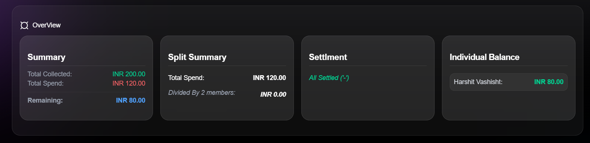

# VibeSplit

**VibeSplit** is a premium, glassmorphism-inspired expense management platform tailored for group travelers and carpoolers. It moves beyond simple "even splits" to provide a transparent, real-time look at group finances, ensuring everyone gets back exactly what they deserve.

## Key Features

- **Individual Savings Tracking**: A unique settlement engine that separates group surplus into individual "refundable" buckets based on over-contribution.
- **Smart Settlements**: Automatically identifies who owes whom, reducing the friction of trip expenses.
- **Glassmorphism UI**: A high-end, modern interface built with Tailwind CSS and Shadcn/UI for a smooth user experience.
- **Zero-Trust Security**: Robust Row Level Security (RLS) ensures trip data is strictly accessible only to verified group members.
- **Invite System**: Fast-track onboarding using unique 6-digit invite codes.

## Visual Preview

- **Dashboard**
|
- **Overview**

- **Join Page**
 |

> **Note:** The UI features a custom Glassmorphism theme built on `Shadcn/UI` and `Tailwind CSS`.

## Architecture

The project follows a **Feature-Based Architecture** for maximum scalability:
- `features/auth`: PKCE-based magic link verification and profile syncing.
- `features/groups`: Logic for trip containers and member invitations.
- `features/entries`: Management of `collect` (funding) and `spend` (costs) transactions.
- `features/savings`: The engine that calculates individual equity from remaining balances.
- `utils/`: Centralized helpers for currency (`INR`) and ID formatting.

## Calculation Logic

VibeSplit utilizes a delta-based settlement logic:
1. **Total Collected**: Total funds a user has put into the group pot.
2. **Total Spend**: Total value a user has consumed from the group pot.
3. **Individual Saving**: `Collected - Spend`. 
   - If positive, the user is entitled to this surplus from the remaining fund.
   - If negative, the user is a "borrower" and owes the group fund.

## Database Schema (Supabase)

- **profiles**: Links `auth.users` to public display names.
- **groups**: Stores trip metadata and the unique `invite_code`.
- **members**: Junction table managing user roles (`admin`/`member`) within groups.
- **entries**: Transactional logs with strict `RESTRICTIVE` RLS policies—only the creator of an entry can modify or delete it.